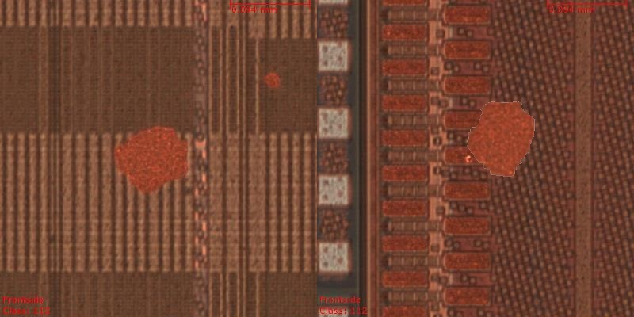

# Guide
## pickle5
- installation pickle5
```bash
pip install pickle5
```
- read log file on python
```python
import pickle5
with open("write log file name", "rb") as f:
    log = pickle5.load(f)
```

## structure of log file
- log is dictionary type binary file

|key|type|vale|
|------------|----|-----------------------------------------------------------|
|src_dir|list|directory of original background image data|
|defects_dir|list|list of directory of defect image|
|output_dir|list|directory of augmented image|
|background_type|list|type of background image; 'orange' or 'green'|
|src_save_dir|list|directory of background image that copy from src_dir|

## compared image
- left : original image of defect
- right : output image of DefectAumentation
- Example :

